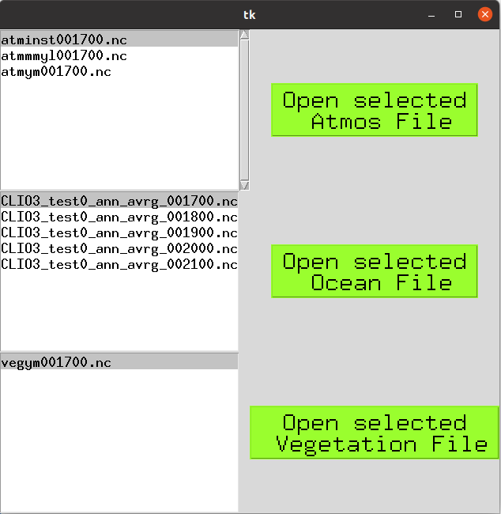
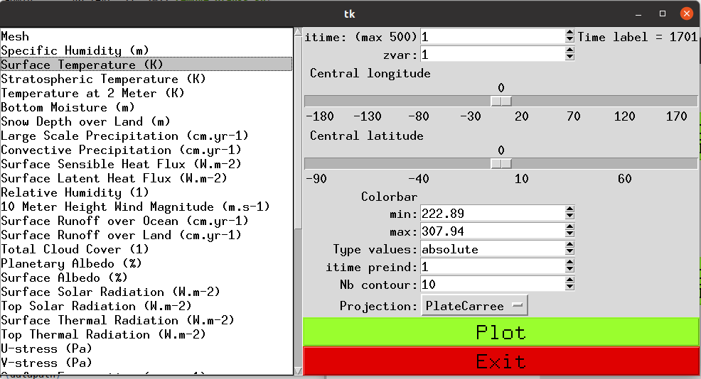
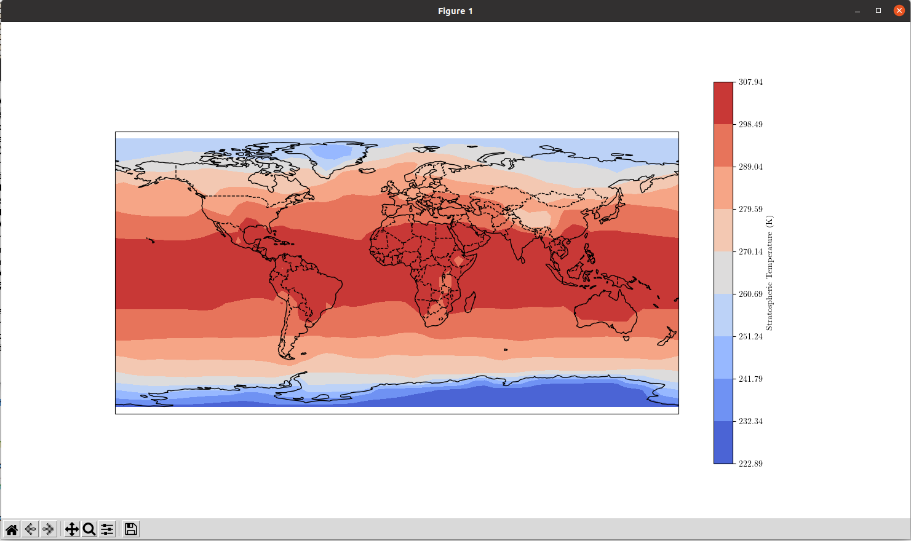

###### Timongo and Chevaldemetal
###### 02/05/2024

# pyLOVECLIM

pyLOVECLIM is a package that can be used to easily plot climatic data from *.nc files from an iLOVECLIM simulation.
iLOVECLIM is available at: [https://www.elic.ucl.ac.be/modx/index.php?id=289](https://www.elic.ucl.ac.be/modx/index.php?id=289)

# \#1 Launch the software and choose which file you open

# \#2 Select the data to plot, the location and the colobar boundaries

# \#3 Result with the surface temperature

